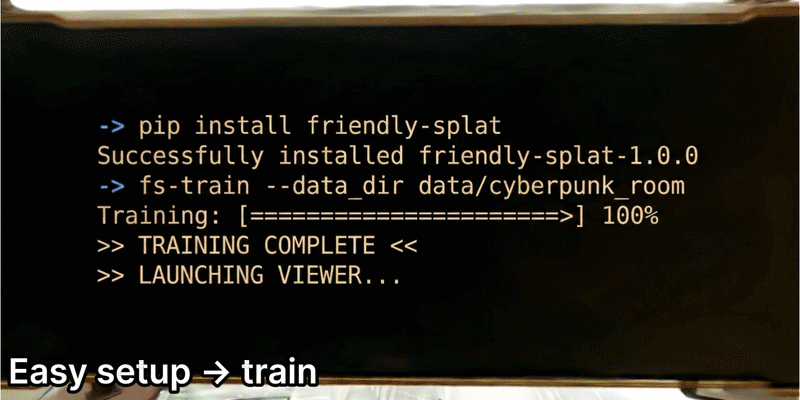

<div align="center">

<p align="center">
  
</p>

<a href="https://ashadowz.github.io/FriendlySplat/">
  
</a>


</div>

## 🤔 Why FriendlySplat

<p align="center">
  <strong><span style="font-size: 1.2em;">Rich Features, Clean Code</span></strong>
</p>

<p align="center">
  
</p>

## 📝 To-Do List

☐ Improve the `Examples` section.<br>
☐ Clearly list the features that are already integrated and the features planned for future integration.<br>
☐ Build proper docs to replace the current collection of README files.

## 📦 Installation

Prerequisite: [PyTorch](https://pytorch.org/get-started/locally/).

```bash
# 1. Environment setup
# Example only; Python and PyTorch version requirements are flexible.
conda create -n friendly-splat python=3.10 -y
conda activate friendly-splat
pip install torch==2.4.0 torchvision==0.19.0 --index-url https://download.pytorch.org/whl/cu121

# 2. Clone and install
git clone https://github.com/AshadowZ/FriendlySplat.git
git submodule update --init --recursive
cd FriendlySplat

# Basic install (train & viewer)
pip install -e ".[train,viewer]" --no-build-isolation

# OR install the full toolchain
# pip install -e ".[train,viewer,mesh,segment,sfm,priors]" --no-build-isolation
```

Tips & Notes:

- Faster Installation: We highly recommend installing [`uv`](https://docs.astral.sh/uv/)
  and replacing `pip` with `uv pip` in the commands above.
- CUDA Build: The `--no-build-isolation` flag is required for `gsplat` to properly
  reuse your local PyTorch/CUDA setup.
- Extra Dependencies: Some tools require additional setup (e.g., the `sfm` extra
  requires HLOC). Please check the respective subfolder docs like
  [tools/sfm/README.md](tools/sfm/README.md).

## 🗂️ Expected Dataset Layout

FriendlySplat expects a COLMAP-style dataset directory under `--io.data-dir`:

```text
data_dir/
  images/
  sparse/0/
  depth_prior/        # optional
  normal_prior/       # optional
  dynamic_mask/       # optional
  sky_mask/           # optional
```

- `images/` stores the training images.
- `sparse/0/` stores the COLMAP reconstruction.
- The prior and mask folders are optional and only needed if you enable the
  corresponding inputs in the config.
- To generate `sparse/0/`, see [tools/sfm/README.md](tools/sfm/README.md). To infer
  geometry priors such as `depth_prior/` and `normal_prior/`, see
  [tools/geometry_prior/README.md](tools/geometry_prior/README.md).

## 🚀 Quick Start

Train on a COLMAP scene:

```bash
fs-train \
  --io.data-dir /path/to/data-dir \
  --io.result-dir /path/to/result-dir \
  --io.device cuda:0 \
  --io.export-splats \
  --io.export-format sog \
  --io.save-ckpt \
  --data.preload none \
  --postprocess.use-bilateral-grid \
  --optim.visible-adam \
  --strategy.impl improved \
  --strategy.densification-budget 1000000
```

`--io.export-format` now accepts `ply`, `ply_compressed`, or `sog`.

If you provide inputs such as `--data.depth-dir-name`, `--data.normal-dir-name`, or
`--data.sky-mask-dir-name`, the corresponding regularization terms are enabled
automatically during training.
See the code for the exact implementation details.

Open the viewer on the latest checkpoint or PLY in a result directory:

```bash
fs-view \
  --result-dir /path/to/result-dir \
  --device cuda \
  --port 8080
```

## 🧪 Examples

This repo provides some examples to help you decide which extra tricks are worth
enabling, and how to tune the many magic-number-like hyperparameters in
`friendly_splat/trainer/configs.py`. This part is still under construction. For now,
you can also use Codex / Claude Code to read the repo and help generate a training
command for your scene.

## 🛠️ Development and Contribution

Issues and pull requests are welcome. The codebase is still evolving, and many
features may not have been widely tested yet, so issue reports are especially welcome.

FriendlySplat is built with substantial help from the broader Gaussian Splatting
community. We first thank
[gaussian-splatting](https://github.com/graphdeco-inria/gaussian-splatting) and
[gsplat](https://github.com/nerfstudio-project/gsplat) for efficient CUDA kernels and
strong feature integration.

We also thank [Improved-GS](https://github.com/XiaoBin2001/Improved-GS),
[AbsGS](https://github.com/TY424/AbsGS),
[taming-3dgs](https://github.com/humansensinglab/taming-3dgs),
[3dgs-mcmc](https://github.com/ubc-vision/3dgs-mcmc), and
[mini-splatting](https://github.com/fatPeter/mini-splatting) for high-quality
densification implementations and references.

For pruning-related ideas and code references, we thank
[GNS](https://github.com/XiaoBin2001/GNS),
[speedy-splat](https://github.com/j-alex-hanson/speedy-splat),
[GaussianSpa](https://github.com/noodle-lab/GaussianSpa), and
[LightGaussian](https://github.com/VITA-Group/LightGaussian).

We also thank [PGSR](https://github.com/zju3dv/PGSR),
[2DGS](https://github.com/hbb1/2d-gaussian-splatting),
[GGGS](https://github.com/HKUST-SAIL/Geometry-Grounded-Gaussian-Splatting),
[dn-splatter](https://github.com/maturk/dn-splatter),
[mvsanywhere](https://github.com/nianticlabs/mvsanywhere), and
[2DGS++](https://github.com/hugoycj/2d-gaussian-splatting-great-again) for their
explorations of geometry regularization and high-quality code releases.

We further thank [CityGaussian](https://github.com/Linketic/CityGaussian) for valuable
code references on urban-scale scene reconstruction, and
[InstaScene](https://zju3dv.github.io/instascene/) together with
[MaskClustering](https://github.com/PKU-EPIC/MaskClustering) for 2D-to-3D lifting
references.

Finally, special thanks to [XiaoBin2001](https://github.com/XiaoBin2001) for helpful
suggestions throughout development.
