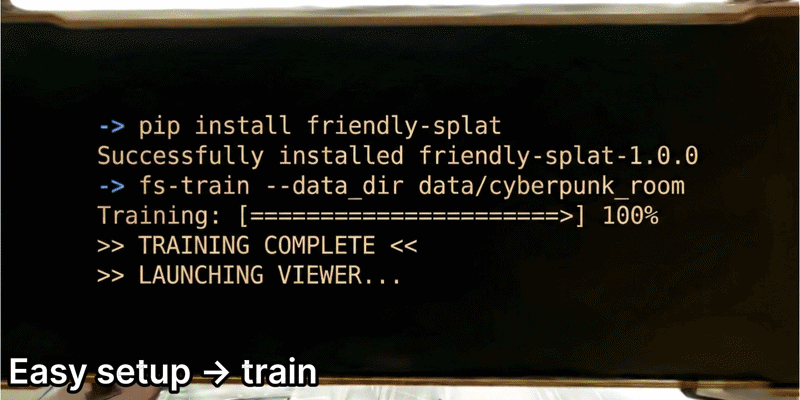

<div align="center">

<p align="center">
  
</p>

<a href="https://ashadowz.github.io/FriendlySplat/">
  
</a>


</div>

## 🤔 Why FriendlySplat

<p align="center">
  <strong><span style="font-size: 1.2em;">Rich Features, Clean Code</span></strong>
</p>

<p align="center">
  
</p>

## 📝 To-Do List

☐ Improve the `Examples` section.<br>
☐ Clearly list the features that are already integrated and the features planned for future integration.<br>
☐ Build proper docs to replace the current collection of README files.

## 📦 Installation

**Platform requirement: Linux with an NVIDIA GPU and CUDA 12.x.** FriendlySplat
compiles CUDA extensions (gsplat, `fused-ssim`, `fused-bilagrid`) during install,
so there is no CPU-only, Windows or macOS path.

**Recommended PyTorch: `torch==2.4.1` + `torchvision==0.19.1`, cu124.** That is
the combination the Docker image and the `uv` lockfile use. The package itself
declares a range (`torch>=2.4,<2.6`), so an existing compatible CUDA build of
PyTorch is kept rather than replaced.

> **NumPy 2 required.** FriendlySplat depends on `numpy>=2.0`. If you are
> upgrading an older environment, any package compiled against the NumPy 1 ABI
> (notably `opencv-python<4.10`) has to be upgraded with it.

```bash
# 1. Environment setup
conda create -n friendly-splat python=3.10 -y
conda activate friendly-splat
pip install torch==2.4.1 torchvision==0.19.1 --index-url https://download.pytorch.org/whl/cu124

# 2. Clone and install
git clone --recursive https://github.com/AshadowZ/FriendlySplat.git
cd FriendlySplat

# Basic install (train & viewer)
pip install ninja
pip install -e ".[train,viewer]" --no-build-isolation

# OR install the full toolchain
# pip install -e ".[train,viewer,mesh,segment,sfm,priors]" --no-build-isolation
```

## Use UV

```
uv sync --all-extras

This creates a `.venv` and installs all optional components, including training, viewer, mesh, segmentation, SfM, geometry priors, and development dependencies.

For only the basic **training + viewer** setup:

```bash
uv sync --extra train --extra viewer
```

Extras can also be selected individually:

```bash
uv sync \
  --extra train \
  --extra viewer \
  --extra mesh \
  --extra segment \
  --extra sfm \
  --extra priors
```

Tips & Notes:

- Faster Installation: We highly recommend installing [`uv`](https://docs.astral.sh/uv/)
  and replacing `pip` with `uv pip` in the commands above.
- CUDA Build: The `--no-build-isolation` flag is required for `gsplat` to properly
  reuse your local PyTorch/CUDA setup.
- Extra Dependencies: Some tools require additional setup (e.g., the `sfm` extra
  requires HLOC). Please check the respective subfolder docs like
  [tools/sfm/README.md](tools/sfm/README.md).

## 🐳 Docker Support

To build and run FriendlySplat using Docker, please follow the steps below:

### Build the Image

Navigate to the project root directory and execute the build command. The example below uses `TORCH_CUDA_ARCH_LIST="8.9"`, which is targeted for an **RTX 4090**.

```bash
docker build --build-arg TORCH_CUDA_ARCH_LIST="8.9" -t friendlysplat:latest .
```

  * **GPU Architecture:** If you are using a different graphics card, please check your GPU architecture via `nvidia-smi` or refer to NVIDIA's compute capability table to confirm and update the `TORCH_CUDA_ARCH_LIST` version to match your specific hardware.
  * **Driver Requirements:** Regardless of your GPU, ensure that your host NVIDIA driver is >= 530.30 to ensure CUDA runtime compatibility with the container.
  * **Large Files Warning:** Exclude unnecessary large files that are **not required for building the Docker environment** (e.g., datasets, checkpoints, outputs) using the `.dockerignore` file to prevent Out-Of-Memory (OOM) crashes during the "transferring context" phase (often surfacing as `rpc error: ... EOF`), excessively long build times and bloated image sizes.

### Run the Container

After a successful build, you can start the container using the following command (make sure to replace `/path/to/FriendlySplat` with your local FriendlySplat project path and `/path/to/your/datasets` with your local dataset path):

```bash
docker run --gpus all -it --rm \
  -v /path/to/your/datasets:/data \
  -v /path/to/FriendlySplat:/app/FriendlySplat \
  -p 8080:8080 \
  --shm-size=8g \
  friendlysplat:latest
```

**Important Notes for Development:**

  * **Hot-Reloading Code:** The `-v` flag maps your local source code directly into the container. If your local code modifications do not affect project dependencies, this mapping allows you to easily verify your code changes without needing to rebuild.
  * **Handling C-Extensions:** Mounting local source code can **overwrite files generated during image build**, such as compiled artifacts like `gsplat/csrc.so`.  `entrypoint.sh` **restores these critical files** from a protected location inside the image, effectively **patching the mounted directory** so the modules remain usable.
  * **Rebuilding on Dependency Changes:** If your local modifications *do* break or change the original dependency relationships (e.g., updating `pyproject.toml` or `setup.py`), you must re-run the `docker build` command to update the system dependencies within the image.
  * **Shared Memory:** The `--shm-size=8g` parameter is crucial. It increases the container's shared memory from the default 64 MB to 8 GB, which prevents the PyTorch DataLoader from crashing during training.

### Using Docker Compose

For a more streamlined development experience, we highly recommend using Docker Compose. It allows you to define all your configurations—including volume mounts for source code, datasets, and model outputs—in a single `docker-compose.yml` file. This drastically reduces the complexity of terminal commands and accelerates your development workflow.

Before running, please ensure you have updated the volume paths in your `docker-compose.yml` to match your local environment. Then, simply execute:

```bash
docker compose run --rm friendlysplat
```

## 🗂️ Expected Dataset Layout

FriendlySplat expects a COLMAP-style dataset directory under `--io.data-dir`:

```text
data_dir/
  images/
  sparse/0/
  depth_prior/        # optional
  normal_prior/       # optional
  dynamic_mask/       # optional
  sky_mask/           # optional
```

- `images/` stores the training images.
- `sparse/0/` stores the COLMAP reconstruction.
- The prior and mask folders are optional and only needed if you enable the
  corresponding inputs in the config.
- To generate `sparse/0/`, see [tools/sfm/README.md](tools/sfm/README.md). To infer
  geometry priors such as `depth_prior/` and `normal_prior/`, see
  [tools/geometry_prior/README.md](tools/geometry_prior/README.md).

## 🚀 Quick Start

Train on a COLMAP scene:

```bash
fs-train \
  --io.data-dir /path/to/data-dir \
  --io.result-dir /path/to/result-dir \
  --io.device cuda:0 \
  --io.export-splats \
  --io.export-format sog \
  --io.save-ckpt \
  --data.preload none \
  --postprocess.use-bilateral-grid \
  --optim.visible-adam \
  --strategy.impl improved \
  --strategy.densification-budget 1000000
```

`--io.export-format` now accepts `ply`, `ply_compressed`, or `sog`.

### FastGS (`--fast`)

Add `--fast` to train with the [FastGS](https://github.com/fastgs/FastGS) recipe
(CVPR 2026). Instead of growing Gaussians wherever the image-plane gradient is
large, FastGS first asks *which Gaussians are actually responsible for the pixels
that are still badly reconstructed*: every densification event renders a handful
of views, marks the high-error pixels, and scores each Gaussian by how much of
that error it accounts for. Only Gaussians that are both high-gradient and
genuinely to blame are allowed to split or clone, the same score drives pruning,
and once the geometry has settled the optimizer stops updating every parameter on
every iteration. The result is fewer Gaussians and less wall time for comparable
quality:

```bash
fs-train \
  --io.data-dir /path/to/data-dir \
  --io.result-dir /path/to/result-dir \
  --fast
```

#### Benchmark: `garden` (MipNeRF360)

Standard protocol — `images_4`, every 8th image held out of training, 30k steps,
PSNR/SSIM computed the way 3DGS's `metrics.py` does
(`--eval.metrics-backend inria`), single NVIDIA T4. Both strategies are given the
same hard `--strategy.densification-budget`, since the Gaussian budget dominates
quality and an unmatched comparison mostly measures capacity.

| Gaussians | strategy | PSNR ↑ | SSIM ↑ | train time ↓ |
| --- | --- | --- | --- | --- |
| 400k | `--strategy.impl improved` | 25.754 | 0.7916 | 21.2 min |
| 400k | `--fast` | **26.211** | **0.8055** | **20.7 min** |
| 1M | `--strategy.impl improved` | **26.860** | 0.8445 | 34.8 min |
| 1M | `--fast` | 26.825 | **0.8505** | **33.6 min** |
| 2.5M | `--strategy.impl improved` | 27.428 | 0.8684 | 63.6 min |
| 2.5M | `--fast` | **27.571** | **0.8706** | **59.8 min** |

`--fast` wins SSIM at all three budgets and is faster at all three; PSNR wins at
400k and 2.5M and ties at 1M (−0.035, within run-to-run variance). Every cell is
a single seed, so treat differences below ~0.1 dB as noise. The `--fast` rows use
`--fastgs.densify-every 100 --fastgs.grad-abs-thresh 0.0003
--fastgs.loss-thresh 0.06 --fastgs.shN-lr 0.02 --fastgs.importance-thresh 0.15
--fastgs.no-final-prune-enable`; full results, protocol and commands are in
[`benchmarks/fastgs/`](benchmarks/fastgs/README.md).

`--fast` replaces `--strategy.impl` and every part of the recipe is settable via
`--fastgs.*`. See **[friendly_splat/fastgs/README.md](friendly_splat/fastgs/README.md)**
for a per-parameter reference with the trade-offs, tuning recipes, the measured
numbers, and how this integration differs from the upstream implementation.

If you provide inputs such as `--data.depth-dir-name`, `--data.normal-dir-name`, or
`--data.sky-mask-dir-name`, the corresponding regularization terms are enabled
automatically during training.
See the code for the exact implementation details.

Open the viewer on the latest checkpoint or PLY in a result directory:

```bash
fs-view \
  --result-dir /path/to/result-dir \
  --device cuda \
  --port 8080
```

## 🧪 Examples

This repo provides some examples to help you decide which extra tricks are worth
enabling, and how to tune the many magic-number-like hyperparameters in
`friendly_splat/trainer/configs.py`. This part is still under construction. For now,
you can also use Codex / Claude Code to read the repo and help generate a training
command for your scene.

## 🛠️ Development and Contribution

### Project Team

FriendlySplat is developed by researchers and contributors from
[Differential Robotics](https://diffrobot.com/),
[FastLab](https://github.com/ZJU-FAST-Lab), and
[Zhejiang University](https://www.zju.edu.cn/english/).

<table cellpadding="6" cellspacing="0">
  <tr>
    <td align="left" valign="middle">
      <a href="https://diffrobot.com/">
        
      </a>
    </td>
    <td align="left" valign="middle">
      <a href="https://github.com/ZJU-FAST-Lab">
        
      </a>
    </td>
    <td align="left" valign="middle">
      <a href="https://www.zju.edu.cn/english/">
        
      </a>
    </td>
  </tr>
</table>

Issues and pull requests are welcome. The codebase is still evolving, and many
features may not have been widely tested yet, so issue reports are especially welcome.

### Acknowledgements

FriendlySplat is built with substantial help from the broader Gaussian Splatting
community. We first thank
[gaussian-splatting](https://github.com/graphdeco-inria/gaussian-splatting) and
[gsplat](https://github.com/nerfstudio-project/gsplat) for efficient CUDA kernels and
strong feature integration.

We also thank [Improved-GS](https://github.com/XiaoBin2001/Improved-GS),
[AbsGS](https://github.com/TY424/AbsGS),
[taming-3dgs](https://github.com/humansensinglab/taming-3dgs),
[3dgs-mcmc](https://github.com/ubc-vision/3dgs-mcmc), and
[mini-splatting](https://github.com/fatPeter/mini-splatting) for high-quality
densification implementations and references.

We thank [FastGS](https://github.com/fastgs/FastGS) for the multi-view consistent
densification and pruning recipe behind `--fast`
(see [friendly_splat/fastgs/README.md](friendly_splat/fastgs/README.md)).

For pruning-related ideas and code references, we thank
[GNS](https://github.com/XiaoBin2001/GNS),
[speedy-splat](https://github.com/j-alex-hanson/speedy-splat),
[GaussianSpa](https://github.com/noodle-lab/GaussianSpa), and
[LightGaussian](https://github.com/VITA-Group/LightGaussian).

We also thank [PGSR](https://github.com/zju3dv/PGSR),
[2DGS](https://github.com/hbb1/2d-gaussian-splatting),
[GGGS](https://github.com/HKUST-SAIL/Geometry-Grounded-Gaussian-Splatting),
[dn-splatter](https://github.com/maturk/dn-splatter),
[mvsanywhere](https://github.com/nianticlabs/mvsanywhere), and
[2DGS++](https://github.com/hugoycj/2d-gaussian-splatting-great-again) for their
explorations of geometry regularization and high-quality code releases.

We further thank [CityGaussian](https://github.com/Linketic/CityGaussian) for valuable
code references on urban-scale scene reconstruction, and
[InstaScene](https://zju3dv.github.io/instascene/) together with
[MaskClustering](https://github.com/PKU-EPIC/MaskClustering) for 2D-to-3D lifting
references.

Finally, special thanks to [XiaoBin2001](https://github.com/XiaoBin2001) for helpful
suggestions throughout development.